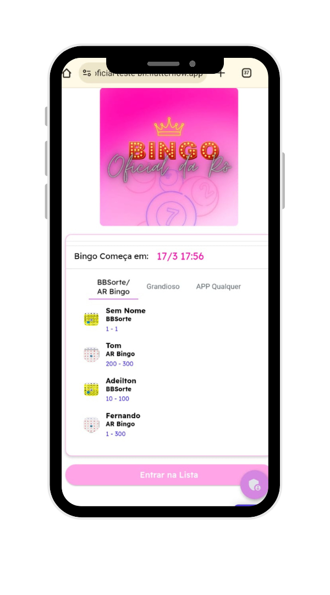

# Aplicativo de Bingo

O Aplicativo de Bingo é uma solução completa para organizar jogos de bingo, oferecendo um gerador de cartelas com diversos designs para tornar a experiência do usuário mais divertida e personalizada.

## Funcionalidades Principais

- **Gerador de Cartelas**: Crie cartelas de bingo de forma rápida e fácil, com diferentes layouts e estilos para atender às suas preferências.
- **Designs Personalizados**: Escolha entre uma variedade de designs de cartelas para uma experiência visualmente agradável.
- **Interface Intuitiva**: Navegação simples e intuitiva para que todos possam utilizar o aplicativo sem dificuldades.
- **Modo de Jogo**: Funcionalidades integradas para facilitar a condução do jogo de bingo, incluindo sorteio de números e verificação de vencedores.

## Tecnologias Utilizadas

- **Dart**: Linguagem de programação utilizada para o desenvolvimento do aplicativo.
- **Flutter**: Framework utilizado para criar interfaces nativas e responsivas para dispositivos móveis.
- **Supabase**: Banco de dados leve e eficiente, livre.

## Estrutura do Projeto

O projeto está organizado da seguinte forma:

